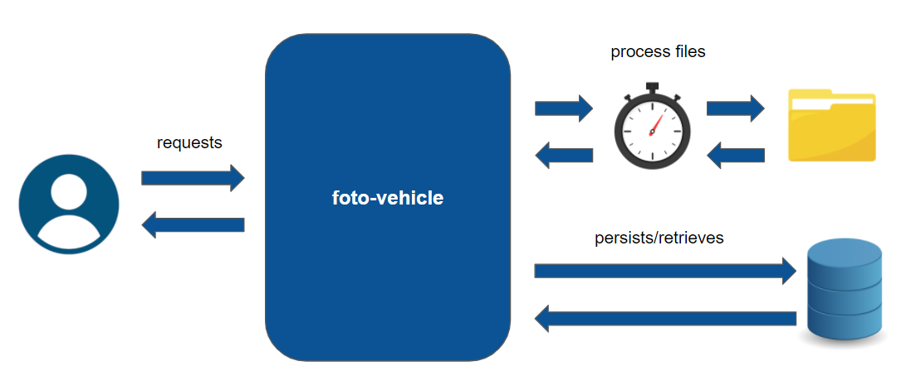
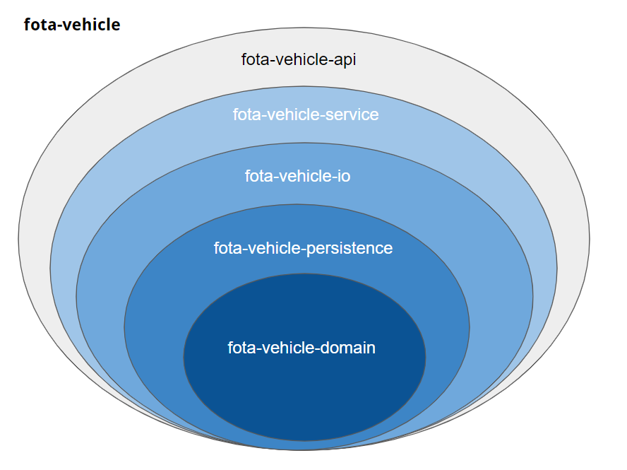
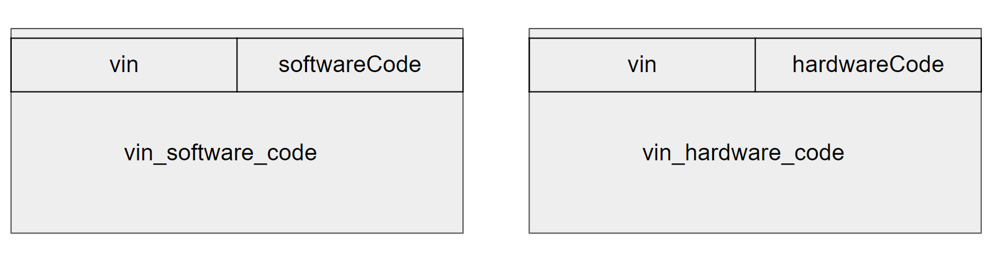

This is the service responsible to inform you which functionalities are compatible with truck's configuration, in terms of software and hardware requirements.

## **Architecture Overview**
This basic flow explains how is the architecture:

Where:
 - The application extracts the files are inside of a specific folder(configurable);
 - The application persists the information inside of the files on data base;  
 - The consumer request information to "foto-vehicle" application;
 - The application returns all information requested by the consumer.
 
## Project structure
Maven is used to organize the project structure(and more). 

There are 4 sub-modules and one parent-module:

Where:

- fota-vehicle: is the parent module;
- fota-vehicle-api: is a sub-module and contains codes related to the Rest API;
- fota-vehicle-service: is a sub-module and contains the business rules and scheduler to extract the information from the files;
- fota-vehicle-io: is a sub-module and contains all classes related to io processing;
- fota-vehicle-persistence: is a sub-module and contains all classes related to data base connection, query and persistence;
- fota-vehicle-domain: is a sub-module and contains all domain-classes/entities to be used across the project.

### Data model

There are two tables: vin_software_code and vin_hardware_code.

There are no "physical" constraints between them. 

They are totally independents:

 

### How to build the code

Requirements:

- JDK 8+ installed
- Maven installed

Procedure:

- download the project
- extract the the bungle 
- access the folder where the project was extract: cd <YOUR_FOLDER>/fota-vehicle/
- run: mvn clean install -DskipTests=true -U

### How to run tests
Requirements:

- JDK 8+ installed
- Maven installed

Procedure:

- access the folder where the project was extract: cd <YOUR_FOLDER>/fota-vehicle/
- run: mvn test

### How to run the service:
Requirements:

- JRE 8+ installed

Procedure:

- access the following folder: cd <YOUR_FOLDER>/fota-vehicle/run-service/
- set the folder where the files will be extract from in "application.properties" file
- run: java -jar fota-vehicle-api-1.0.0-RELEASE.jar --spring.config.location=file://application.properties 
